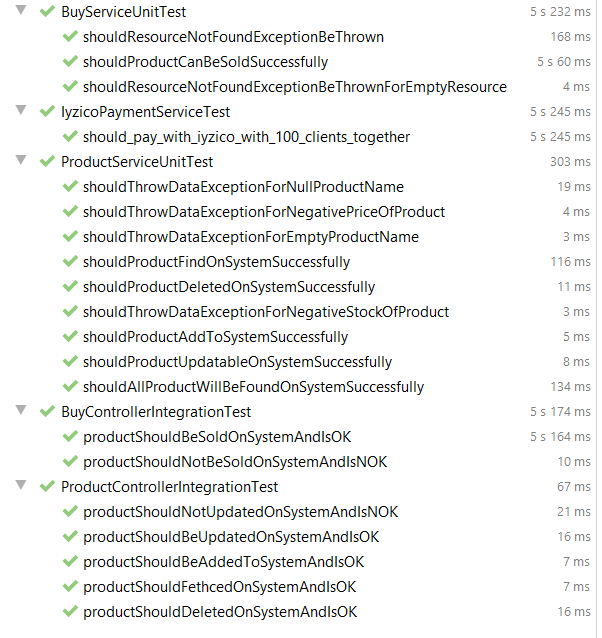

# Product and Payment Management System RESTAPIDoc

These restapi were designed to perform simulate product and payment management system using [Spring Framework](https://spring.io/)

Where full URLs are provided in responses they will be rendered as if service
is running on 'http://localhost:8080/'.

### Product related

Each endpoint manipulates or displays information related to the product on the system.

* [Add Product](src/main/java/com/iyzico/challenge/controller/ProductController.java) : `POST /product/add/`
* [Update Product](src/main/java/com/iyzico/challenge/controller/ProductController.java) : `PUT /product/remove/{id}`
* [Remove Product](src/main/java/com/iyzico/challenge/controller/ProductController.java) : `DELETE /product/remove/{id}`
* [Get Product](src/main/java/com/iyzico/challenge/controller/ProductController.java) : `GET /product/get/{id}`
* [Get All Products](src/main/java/com/iyzico/challenge/controller/ProductController.java) : `GET /product/get`

### Buy related

Endpoints for viewing and manipulating the sell process that integrating products on the system.

* [Buy Product](src/main/java/com/iyzico/challenge/controller/BuyController.java) : `POST /buy`

### Unit and Integration Tests 

  <figure>
  
   <figcaption>Unit and Integration Tests</figcaption>
  </figure>

 
